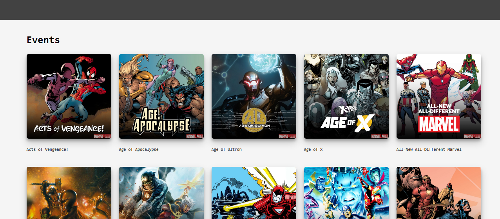

# PWA1920 | Marvel Library



Marvel Library is a library of Marvel related overviews (comics, characters and series). Made with Node.js (server side rendered) and by retrieving data from the Marvel API.

## Table of contents
- [Live Demo](#live-demo)
- [Features](#features)
- [Install](#install)
- [API](#api)
- [Dependencies](#dependencies)
- [Wishlist](#wishlist)

## Live Demo
[Link](https://pwa-michel.herokuapp.com/)

## Features
- Retrieve data from Marvel API about comics, series and events
- Server side rendering, completely usable without client side Javascript
- Install web-app from your browser, completely usable on the installed app
- Caching previously visited pages along with the core assets listed below
    - Home page
    - Offline page
    - Styling
    - Marvel logo
- Display offline page when unable to connect to the internet
- Build files to static folder with gulp
- Improvement of the critical render path
    - Building and minify multiple stylesheets to 1 stylesheet
    - Gzip compression of certain files

## Install
1. Clone repo
    ```
    $ git clone https://github.com/mich97/progressive-web-apps-1920.git
    ```
2. Move to directory
    ```
    $ cd progressive-web-apps-1920
    ```
3. Install dependencies
    ```
    $ npm install
    ``` 
4. Run
    ```
    $ npm run start
    ```
5. Open following url in browser
    ```
   localhost:3000
   ```
   
## API
This web-app was made by making use of the Marvel API. The Marvel API allows developers everywhere to access information about Marvel's vast library of comics—from what's coming up, to 70 years ago, 3000 calls can be made daily. Documentation can be found [here](https://developer.marvel.com/docs).

## Dependencies
List of used (dev) dependencies
```
  "dependencies": {
    "compression": "^1.7.4",
    "dotenv": "^8.2.0",
    "ejs": "^3.0.1",
    "express": "^4.17.1",
    "gulp": "^4.0.2",
    "gulp-autoprefixer": "^7.0.1",
    "gulp-clean-css": "^4.2.0",
    "gulp-concat": "^2.6.1",
    "md5": "^2.2.1",
    "node-fetch": "^2.6.0",
    "npm-run-all": "^4.1.5",
    "rimraf": "^3.0.2"
  },
  "devDependencies": {
    "chokidar-cli": "^2.1.0",
    "nodemon": "^2.0.2"
  }
```

## Wishlist
- [x] Server side rendering
- [x] Installable
- [x] Caching pages and core assets
- [x] Tooling with gulp
- [x] Minify certain files
- [x] Dynamic fetching and rendering
- [x] Gzip compression
- [ ] Placeholder images when loading
- [ ] More categories
- [ ] Display more information on detail pages